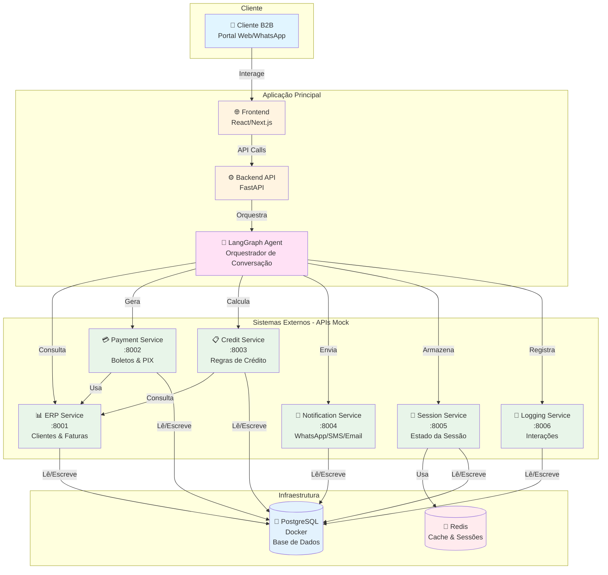

# SafraBoleto - Agente de Renegociação e Cobrança Digital B2B

Sistema de automação de cobrança e renegociação B2B para empresas do agronegócio, utilizando agentes de IA para interagir com clientes e facilitar o processo de negociação de faturas em aberto.

## 📋 Sobre o Projeto

O SafraBoleto é uma solução que automatiza o contato inicial e recorrente de cobrança B2B por canais digitais, permitindo que clientes empresariais consultem faturas em aberto, negociem opções de pagamento dentro das regras de crédito e gerem boletos/PIX de forma autônoma.

## 🏗️ Arquitetura do Sistema



### Fluxo Principal

1. **Cliente** acessa o sistema via Portal Web ou WhatsApp
2. **Frontend** recebe a interação e envia para o **Backend**
3. **Backend** orquestra o **LangGraph Agent** que gerencia a conversa
4. **Agent** interage com os sistemas externos que implementam lógica de negócio enterprise:
   - Consulta **ERP Service** para obter dados do cliente (incluindo hierarquia de contatos e tier), faturas e histórico
   - O **ERP Service** identifica o papel do contato (Comprador/Financeiro) e adapta permissões e linguagem
   - Usa **Credit Service** para calcular dívida com juros compostos e gerar cenários de renegociação dinâmicos
   - O **Credit Service** valida alçadas de aprovação e aplica regras de negócio baseadas em tier e rating
   - Solicita **Payment Service** para gerar boletos/PIX com processamento assíncrono
   - O **Payment Service** simula delay bancário (10-30s) e envia confirmação via webhook
   - **Session Service** detecta clientes inativos (>90 dias) e aplica estratégias de win-back
   - Envia notificações via **Notification Service** com templates personalizados
   - Armazena estado complexo da sessão no **Session Service** (histórico de propostas, restrições, preferências)
   - Registra interações estruturadas no **Logging Service** para auditoria
5. **Redis** armazena estado temporário das sessões ativas com TTL configurável
6. **PostgreSQL** (rodando no Docker) é a base de dados central para todos os sistemas externos, mantendo integridade referencial e histórico completo
7. **Dados iniciais** podem ser populados no PostgreSQL a partir do arquivo Excel (`cnpomapa30092019.xlsx`)

### Características Enterprise

- **Lógica de Negócio Complexa:** Cada serviço implementa regras de negócio realistas, não apenas CRUD simples
- **Processamento Assíncrono:** Webhooks, delays simulados e máquinas de estado refletem integrações bancárias reais
- **Hierarquia e Permissões:** Sistema de contatos com papéis distintos e adaptação de linguagem baseada em contexto
- **Cálculos Financeiros Reais:** Juros compostos, multa pro-rata dia e alçadas de aprovação simulam ambiente corporativo real
- **Estratégias de Engajamento:** Win-back automático para clientes inativos e análise de comportamento por sessão

### Objetivos

- Automatizar cobrança B2B por canais digitais (portal web, WhatsApp, e-mail)
- Permitir que clientes consultem e negociem faturas em aberto
- Gerar boletos e PIX automaticamente após acordo
- Preservar relacionamento com tom respeitoso e empático
- Reduzir prazo médio de recebimento (PMR)

## 🚀 Como Começar

### Pré-requisitos

- Python 3.10 ou superior
- [uv](https://github.com/astral-sh/uv) (gerenciador de dependências)

### Instalação

1. Clone o repositório:
```bash
git clone <url-do-repositorio>
cd safraboleto
```

2. Crie o ambiente virtual e instale as dependências:
```bash
uv venv
source .venv/bin/activate  # Linux/Mac
# ou
.venv\Scripts\activate  # Windows

uv sync
```

### Iniciando a Infraestrutura

1. Inicie o PostgreSQL no Docker:
```bash
cd docker
docker-compose up -d postgres
```

2. Execute as migrações (quando disponíveis):
```bash
# Script de criação do schema será criado
```

### Executando os Sistemas Externos

Os sistemas externos (APIs mock) podem ser executados independentemente:

```bash
# Serviço ERP (Porta 8001)
cd integrations/erp_service
uv run python main.py

# Serviço de Pagamentos (Porta 8002)
cd integrations/payment_service
uv run python main.py

# Motor de Regras de Crédito (Porta 8003)
cd integrations/credit_service
uv run python main.py

# Serviço de Notificações (Porta 8004)
cd integrations/notification_service
uv run python main.py

# Session Store (Porta 8005)
cd integrations/session_service
uv run python main.py

# Serviço de Logging (Porta 8006)
cd integrations/logging_service
uv run python main.py
```

Cada serviço expõe documentação automática em:
- Swagger UI: `http://localhost:PORT/docs`
- Health check: `http://localhost:PORT/health`

## 📁 Estrutura do Projeto

```
safraboleto/
├── integrations/          # Sistemas externos (APIs mock)
│   ├── erp_service/       # Porta 8001 - Clientes, faturas e acordos
│   ├── payment_service/   # Porta 8002 - Boletos e PIX
│   ├── credit_service/    # Porta 8003 - Regras de crédito
│   ├── notification_service/ # Porta 8004 - Notificações
│   ├── session_service/   # Porta 8005 - Armazenamento de sessões
│   └── logging_service/   # Porta 8006 - Logging de interações
├── backend/              # Aplicação backend principal (a criar)
├── frontend/             # Aplicação frontend (a criar)
├── docker/               # Infraestrutura Docker
│   ├── docker-compose.yml  # Orquestração de serviços
│   └── postgres/        # Configuração PostgreSQL
├── docs/                 # Documentação
│   ├── requisitos.md     # Requisitos e especificações
│   └── cnpomapa30092019.xlsx  # Dados de referência para mock
├── pyproject.toml        # Dependências do projeto
└── README.md
```

## 🔧 Sistemas Externos

Os sistemas externos do SafraBoleto são APIs mock que simulam serviços enterprise reais, implementando lógica de negócio complexa para criar uma experiência realista de software B2B. Cada serviço possui regras de negócio, validações e comportamentos assíncronos que refletem a complexidade de sistemas corporativos reais.

### 1. Serviço ERP Financeiro (Porta 8001)

Sistema ERP enterprise que gerencia clientes, faturas e acordos de renegociação com lógica de negócio avançada.

**Lógica de Negócio:**
- **Hierarquia de Contatos:** Suporta múltiplos contatos por cliente com papéis distintos (Comprador, Financeiro, Gestor). O sistema identifica automaticamente o papel do contato e adapta a linguagem e permissões de acesso.
- **Tiers de Clientes:** Sistema de classificação em tiers (Bronze, Prata, Ouro) que impacta prazos de pagamento, limites de crédito e condições comerciais.
- **Gestão de Acordos:** Rastreamento completo do ciclo de vida de acordos, incluindo estados intermediários e validações de conformidade.

**Endpoints principais:**
- `GET /customers/{cnpj}` - Busca cliente por CNPJ com hierarquia de contatos e tier
- `GET /customers/{customer_id}/invoices` - Lista faturas do cliente com filtros avançados
- `GET /customers/{customer_id}/contacts` - Lista contatos do cliente com seus papéis
- `POST /agreements` - Cria acordo de renegociação com validações de negócio
- `GET /agreements/{agreement_id}` - Consulta status do acordo com histórico de estados
- `GET /customers/{customer_id}/tier` - Consulta tier e benefícios do cliente

**Base de dados:** PostgreSQL (Docker)  
**Dados iniciais:** Podem ser populados a partir do arquivo `docs/cnpomapa30092019.xlsx`

### 2. Serviço de Pagamentos (Porta 8002)

Sistema de pagamentos que simula integração bancária real com processamento assíncrono e webhooks.

**Lógica de Negócio:**
- **Delay Bancário Simulado:** Simula o tempo real de processamento bancário (10-30 segundos) para geração e confirmação de pagamentos.
- **Webhooks Assíncronos:** Sistema de notificações assíncronas via webhook que simula a confirmação de pagamento pelo banco, incluindo retentativas e timeouts.
- **Estados de Pagamento:** Máquina de estados complexa (Pendente, Processando, Confirmado, Falhou, Cancelado) com transições validadas.

**Endpoints principais:**
- `POST /payments/boleto` - Gera boleto bancário (retorna imediatamente, confirmação via webhook)
- `POST /payments/pix` - Gera cobrança PIX (retorna imediatamente, confirmação via webhook)
- `GET /payments/{payment_id}/status` - Consulta status do pagamento
- `POST /payments/{payment_id}/webhook` - Endpoint para receber confirmações bancárias (simulado)
- `GET /payments/{payment_id}/history` - Histórico de estados do pagamento

**Comportamento Assíncrono:** Após gerar um pagamento, o sistema simula um delay de 10-30 segundos antes de enviar um webhook de confirmação, refletindo o comportamento real de gateways bancários.

### 3. Motor de Regras de Crédito (Porta 8003)

Motor de regras enterprise que calcula cenários de renegociação usando algoritmos financeiros reais.

**Lógica de Negócio:**
- **Cálculo de Dívida com Juros Compostos:** Implementa cálculo real de juros compostos e multa pro-rata dia, não valores estáticos.
- **Alçadas de Aprovação:** Sistema de alçadas baseado em valor de desconto, rating do cliente e histórico. Descontos acima de 10% exigem aprovação humana simulada.
- **Cenários Dinâmicos:** Gera múltiplos cenários de renegociação considerando capacidade de pagamento, restrições de sessão e políticas de crédito.

**Endpoints principais:**
- `POST /credit-rules/generate-options` - Gera cenários de renegociação com cálculos financeiros reais
- `POST /credit-rules/validate-scenario` - Valida cenário escolhido e verifica alçadas
- `POST /credit-rules/calculate-debt` - Calcula dívida total com juros compostos e multa
- `POST /credit-rules/check-approval` - Verifica se cenário requer aprovação humana

**Regras:** Configuradas em `integrations/credit_service/config/credit_rules.json`  
**Algoritmos:** Ver especificações técnicas em `docs/business_rules_specs.md`

### 4. Serviço de Notificações (Porta 8004)

Sistema de notificações multi-canal com templates e rastreamento de entrega.

**Endpoints principais:**
- `POST /notifications/send` - Envia notificação (WhatsApp, SMS, Email)
- `GET /notifications/{notification_id}/status` - Consulta status de entrega
- `GET /notifications/templates` - Lista templates disponíveis por canal

### 5. Session Store (Porta 8005)

Gerenciamento avançado de sessões com lógica de win-back e análise de comportamento.

**Lógica de Negócio:**
- **Win-back de Clientes Inativos:** Detecta clientes inativos há mais de 90 dias e aplica estratégias de reengajamento automático.
- **Análise de Sessão:** Rastreia padrões de comportamento, tempo de resposta e taxa de conversão por sessão.
- **Gestão de Estado Complexa:** Armazena estado completo da negociação, incluindo histórico de propostas, restrições coletadas e preferências do cliente.

**Endpoints principais:**
- `POST /sessions` - Cria sessão com contexto de cliente
- `GET /sessions/{session_id}` - Recupera sessão completa
- `PUT /sessions/{session_id}` - Atualiza sessão
- `DELETE /sessions/{session_id}` - Remove sessão
- `GET /sessions/customer/{customer_id}/inactive` - Identifica clientes inativos para win-back
- `POST /sessions/{session_id}/winback` - Dispara estratégia de win-back

**Redis:** Utilizado para cache de sessões ativas com TTL configurável

### 6. Serviço de Logging (Porta 8006)

Sistema de logging estruturado para auditoria e análise de interações.

**Endpoints principais:**
- `POST /interactions/log` - Registra evento estruturado
- `GET /interactions/{customer_id}/history` - Histórico completo do cliente
- `GET /interactions/analytics` - Métricas agregadas de interações

## 🛠️ Desenvolvimento

### Comandos Úteis

```bash
# Instalar dependências
uv sync

# Executar testes
pytest

# Verificar lint
ruff check .

# Formatar código
ruff format .

# Executar serviço específico
cd integrations/erp_service
uv run python main.py
```

### Adicionando Novas Dependências

```bash
# Adicionar dependência
uv add nome-do-pacote

# Adicionar dependência de desenvolvimento
uv add --dev nome-do-pacote
```

## 📚 Documentação

- **Requisitos completos:** Ver `docs/requisitos.md`
- **Especificações técnicas de regras de negócio:** Ver `docs/business_rules_specs.md` (tiers, cálculos financeiros, fluxos de estado)
- **Documentação de APIs:** Cada serviço tem documentação Swagger em `/docs`
- **Dados de referência:** `docs/cnpomapa30092019.xlsx` (usado para popular banco inicialmente)

## 🎯 Status do Projeto

### ✅ Concluído

- [x] Estrutura de sistemas externos criada
- [x] Modelos de dados definidos
- [x] Estrutura de routers criada
- [x] Documentação de requisitos organizada

### ⏳ Em Progresso

- [ ] Configuração do PostgreSQL no Docker
- [ ] Criação do schema do banco de dados
- [ ] Implementação dos endpoints dos serviços
- [ ] Script de população inicial do banco a partir do xlsx
- [ ] Integração com LangGraph agent
- [ ] Implementação do backend principal
- [ ] Implementação do frontend

## 📝 Licença

[Adicionar licença quando aplicável]

## 🤝 Contribuindo

[Adicionar guia de contribuição quando aplicável]
